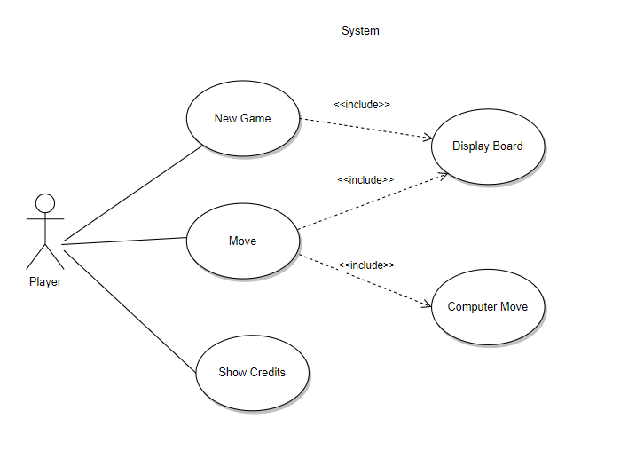
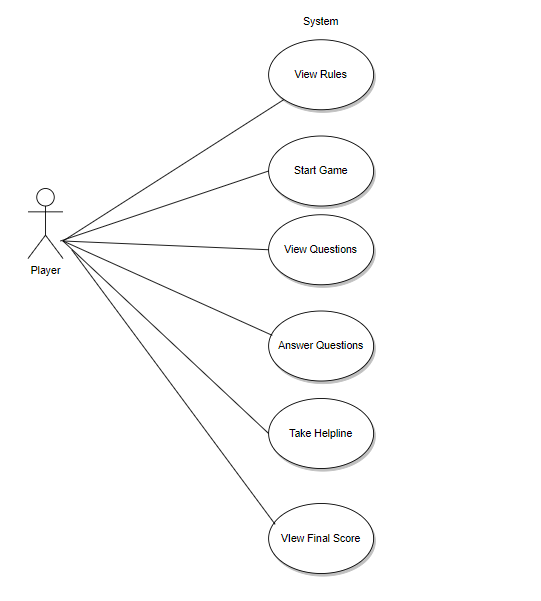
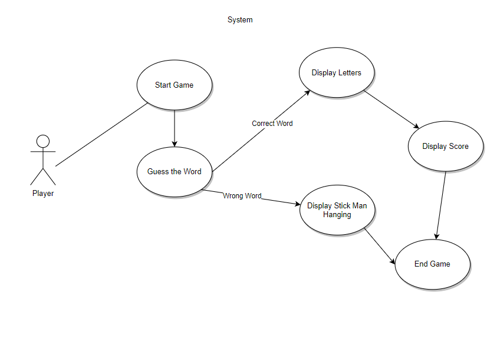

# Design
### Game Zone Flowchart

### Game Zone Usecase Diagram

### Game Zone Component Diagram

### Usecase Diagrams TicTacToe

### TicTacToe flowchart

### Usecase Diagrams QuizGame 

### QuizGame flowchart

### Usecase Diagrams Hangman

### Hangman flowchart

###  Usecase Diagrams Snake Game

###  Snake Game flowchart

